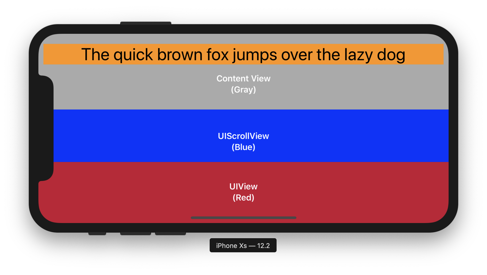
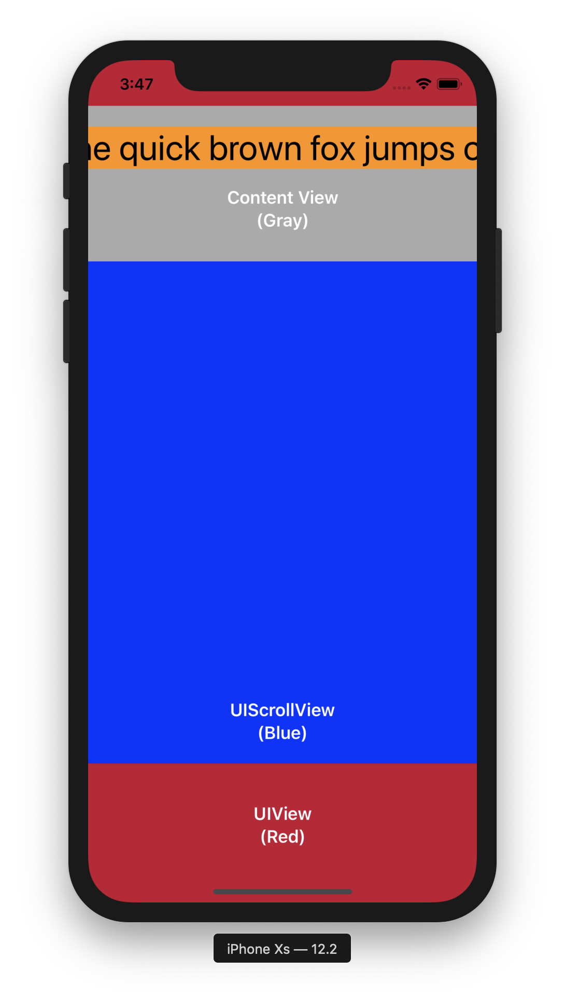

#  (Horizontally) scrollable without code

A super simple sample of how you should set up your constraints to setup a `UIScrollView` in Xcode directly.

**Big Shout out to [Ortwin Gentz](https://twitter.com/ortwingentz) for his help!**

For better understanding I've added some colors showing the different elements:

- Red is the View at the Root of the View Controller Hierarchy.
- Blue is the ScrollView hosting the content.
- Gray is the Content View.
- Orange is the single content (Label) which will scroll.

It's important that the orange (as well as the gray) gets the whole width of the device.

For this, it's important to notice that `Content View` has 2 `Equal Width` Constraints:

- `=` @ Priority 250.
- `>=` @ Priority 1000.

**Without this last one, the gray view would stop at the length of the label in landscape, not allowing to position stuffs centered or right aligned.**

I hope this will help someone lost in the world of constraints. This person might owe me (and Ortwin!) a Beer ;-)

